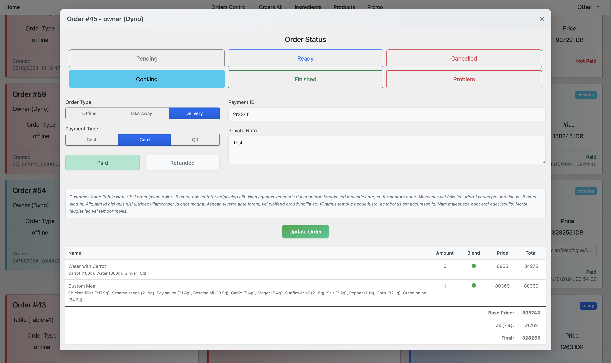

Full stuck development, maily backend tho, for the restaurant I wanted to open how I see it. The restaurant where people can be very flexible - they can choose by kCal, ingredienst or nutritions. Not usual dishes, but these, that can be customized for health. Planned for Tablets, ordering from tablets, managing from tablets and kitchen receives info to tables.

> For images scroll down.

First at all my goals:
- People can choose ready dishes OR they can collect their own:
  - For each order they have total Calories and main Nutritions.
  - If they choose from menu - all dishes are flexible, for each dish they can choose how many calories they need. Then they can add to the card OR customise, deleting or adding ingredients.
  - If they choose custom - they can collect a custom dish from available ingredients, they see all Nutritions they choose.
- After collecting the meal they go to cart to finish order, there's also service & tax. They also can use Promo before continue with discount. 
- When order is finished, it should receive status "Cooking"
  - Pay online (not realized) - the order should receive status "Cooking".
  - Pay offline / different - the order receive status "Pending" and goes to "Control Panel" where Admin can receive payment and change status to "Cooking".
- With status "Cooking" the order is visible in Kitchen page where cooks can prepare food. Then they change status to "Ready"
- The order goes back to "Control panel" where Admin can deliver food OR people collect it.

All statuses:
- Pending - waiting for payment
- Cooking - paid, waiting for cooking
- Ready - cooked, waiting for collection
- Finished - GOOD, cooked and delivered
- Cancelled - if cancelled
- Problem - any other situation

Also order has:
- Type - Offline, Take Away, Delivery
- Payment Type - Cash, Card, QR
- Boolean - Paid / Refunded
- Text: Payment ID, Public Note, Private Note
- Order info

I don't remember all differences in access for different type of accounts... Owner has all rights, Admin for managing, Table can only make orders and check his last order, Kitchen - only see current orders, mark them as ready and change ingredients availability. Accesses with current DB:
- Owner access: login dyno, pass 1
- Admin access: a:1
- Table: t:1
- Kitchen: k:1

Other stuff:
- if you turn off an ingredient - it disables it from ordering... and all products from Menu thay have that ingredients will be disabled. Turn off ingredients can Owner, Admin and Kitchen

---

## Images

### Customer page (no design)

Main page

Create Custom

Cart

Last Order

### Control Panel

Orders Control

Orders All

Order

All Ingredients

Ingredient

All Products

Product

All Promo

Promo

### Kitchen

Kitchen

Kitchen Order

---

* Table can't logout, for kitchen - go http://127.0.0.1:8000/logout
* Generate ingredients & products `python manage.py populate_db`